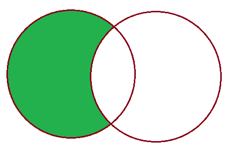

# V-5. DB lentelių jungimas naudojant joint

Šioje paskaitoje pristatoma, kaip naudojant SQL rašomi lentelių ir jų įrašų apjungimo sakiniai ir užklausos naudojant join. Naudojant join mes galime įvairiais būdais apjungti keletą lentelių naudojant unikalius identifikatorius. Join (sujungimas) matematiškai apibrėžiama kaip releacinė algebra, kurią taikant galima atlikti įrašų aibių skirtingose esybėse sąjungos, sankirtos, skirtumo ir kt. operacijas. Paskaitoje panagrinėsime keletą pagrindinių operacijų.

## Pasiruoškime duomenų bazę

Pradžioje pasiruoškime paskaitos demonstracijai reikalingą duomenų bazę ir pradines lenteles taikant mums jau žinomas ir pirmose V skyriaus prezentacijose pristatytas SQL komandas:

Sukurkime demonstracijai skirtą db:
```sql
create database studies_demo_join;
```

Sukurkime reikalingas demonstracijai lenteles:
```sql

-- Sklypų lentelė
CREATE TABLE nt_sklypai (
    id INT PRIMARY KEY,
    savininkas VARCHAR (100) NOT NULL,
    sklypo_nr VARCHAR (20) NOT NULL
);

-- Pastatų lentelė
CREATE TABLE nt_pastatai (
    id INT PRIMARY KEY,
    savininkas VARCHAR (100) NOT NULL,
    miestas VARCHAR (100) NOT NULL
);

```

Užpildykime lenteles:

```sql

INSERT INTO nt_sklypai (id, savininkas, sklypo_nr)
VALUES
    (1, 'Andrius', '1111-1111-1111'),
    (2, 'Tomas', '2222-2222-2222'),
    (3, 'Jonas', '3333-3333-3333'),
    (4, 'Marius', '4444-4444-4444');

INSERT INTO nt_pastatai (id, savininkas, miestas)
VALUES
    (1, 'Giedrius', 'Vilnius'),
    (2, 'Andrius', 'Kaunas'),
    (3, 'Jurgis', 'Klaipėda'),
    (4, 'Tomas', 'Pakruojis');

```

## Inner Join (vidinė sankirta)

Sankirta - tai visų įrašų, kurie priklauso abiems jungiamiesiems santykiams, aibė. 


Sankirtos metu palyginamos abi lentelės (esybės) pagal konkretų nurodytą stulpelį ir atrenkami įrašai, kurių nurodyto stulpelio reikšmės sutampa.

```sql
SELECT
    sklypai.id as "sklypas",
	pastatai.id as "pastatas",
    sklypai.savininkas as "savininkas"
FROM
    nt_sklypai sklypai
INNER JOIN nt_pastatai pastatai
    ON sklypai.savininkas = pastatai.savininkas;
```

## Left Join (kairysis sujungimas)

Kairysis sujungimas atrenka visus įrašus kairėje esančioje lentelėje (pirmoje lentelėje select sakinyje) ir pagal konkretaus stulpelio reikšmes pasikartojančius įrašus dešinėje esančioje lentelėje.


```sql
SELECT
    sklypai.id as "sklypas",
	pastatai.id as "pastatas",
    sklypai.savininkas as "savininkas"
FROM
    nt_sklypai sklypai
LEFT JOIN nt_pastatai pastatai
    ON sklypai.savininkas = pastatai.savininkas
```

Jeigu norima iš kairėje esančios lentelės atrinkti tik tuos įrašus, kurie neturi atitikmens dešinėje esančioje lentelėje, papildomai turime pritaikyti <i>where</i> sąlygą ir nurodyti, kad dešinėje esančios lentelės id neturi būti lygus NULL.



```sql
SELECT
    sklypai.id as "sklypas",
	pastatai.id as "pastatas",
    sklypai.savininkas as "savininkas"
FROM
    nt_sklypai sklypai
LEFT JOIN nt_pastatai pastatai
    ON sklypai.savininkas = pastatai.savininkas
WHERE pastatai.id IS NULL;
```

## Right Join (dešinysis sujungimas)

Dešinysis sujungimas atrenka visus įrašus dešinėje esančioje lentelėje (antroje lentelėje select sakinyje) ir pagal konkretaus stulpelio reikšmes pasikartojančius įrašus kairėje esančioje lentelėje.


```sql
SELECT
    sklypai.id as "sklypas",
	pastatai.id as "pastatas",
    pastatai.savininkas as "savininkas"
FROM
    nt_sklypai sklypai
RIGHT JOIN nt_pastatai pastatai
    ON sklypai.savininkas = pastatai.savininkas;
```

Jeigu norėtume dešinėje esančioje lentelėje atrinkti tik tuos įrašus, kurie nepasikartoja kairėje esančioje lentelėje - mums reikėtų pritaikyti <i>where</i> sąlygą, kaip tą atlikome ir Left Join atveju.

## Full Join (pilna sąjunga)

Santykių sąjungos pagalba galime sujungti abiejų lentelių įrašus pagal nurodyto stulpelio reikšmes.


```sql
SELECT
    sklypai.id as "sklypas",
	sklypai.savininkas as "savininkas",
	pastatai.id as "pastatas",
    pastatai.savininkas as "savininkas"
FROM
    nt_sklypai sklypai
FULL JOIN nt_pastatai pastatai
    ON sklypai.savininkas = pastatai.savininkas;
```

Jeigu iš abiejų lentelių norėtume atrinkti tik nepasikartojančius pagal nurodyto stulpelio reikšmes įrašus, papildomai select sakinį turėtume išplėst <i>where</i> sąlyga.


```sql
SELECT
    sklypai.id as "sklypas",
	sklypai.savininkas as "savininkas",
	pastatai.id as "pastatas",
    pastatai.savininkas as "savininkas"
FROM
    nt_sklypai sklypai
FULL JOIN nt_pastatai pastatai
    ON sklypai.savininkas = pastatai.savininkas
WHERE pastatai.id IS NULL or sklypai.id is NULL;
```