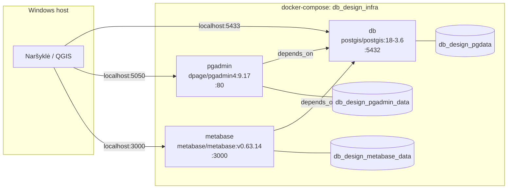

# Duomenų bazių projektavimo kurso aplinkos diegimas (Windows)

Ši instrukcija paaiškina, kaip savo Windows kompiuteryje paruošti kursui reikalingą aplinką: PostgreSQL + PostGIS, pgAdmin ir Metabase, veikiančius per Docker.

**SVARBU** - tai demonstracijoms, mokymui skirta docker infrastruktūros konfigūracija, kuri neturėtų būti diegiama gamybinėse aplinkose.

## 1. Konfigūruojama infrastruktūra



## 2. Docker Desktop diegimas

1. Eiti į [docker.com/products/docker-desktop](https://www.docker.com/products/docker-desktop) ir parsisiųsti Windows versiją.
2. Paleisti diegiklį. Diegimo metu patvirtinti **WSL2** backend naudojimą (jei WSL2 dar neįdiegtas, diegiklis pats pasiūlys jį įdiegti - gali prireikti perkrauti kompiuterį).
3. Po perkrovimo paleisti Docker Desktop programą ir palaukti, kol apačioje kairėje pasirodys užrašas **"Engine running"**.

## 3. docker-compose.yml failas

Sukurti naują aplanką (pvz. `C:\db-kursas\`) ir jame įrašyti failą pavadinimu `docker-compose.yml` su [docker-compose.yml](docker-compose.yml) esančiu turiniu. Arba galite tiesiog klonuoti visą GIT repozitoriją.

## 4. Aplinkos paleidimas

1. Atidaryti PowerShell terminalą tame aplanke, kuriame yra `docker-compose.yml` (dešiniu pelės klavišu aplanke → "Open in Terminal", arba `cd C:\gis-kursas\`).
2. Paleisti komandą:
   ```powershell
   docker compose up -d
   ```
3. Palaukti - pirmą kartą užtrunka kelias minutes, nes atsisiunčiami images iš interneto.
4. Patikrinti, ar visi trys servisai veikia:
   ```powershell
   docker compose ps
   ```
   Visų trijų (`db`, `pgadmin`, `metabase`) statusas turi būti `running` arba `Up`.

## 5. Prieiga prie servisų

| Servisas                               | Adresas                                     | Prisijungimas                                 |
| -------------------------------------- | ------------------------------------------- | --------------------------------------------- |
| pgAdmin                                | http://localhost:5050                       | admin@admin.com / admin                       |
| Metabase                               | http://localhost:3000                       | susikuriama pirmo paleidimo metu              |
| PostgreSQL (iš QGIS, pgModeler ir kt.) | `localhost:5432` (arba `5433`, jei keitėte) | vartotojas `postgres`, slaptažodis `postgres` |

**Jungiantis prie DB per pgAdmin (konteinerinį)**, serverio nustatymuose nurodyti host `db` (ne `localhost`), nes pgAdmin konteinerio viduje mato duomenų bazės konteinerį pagal jo serviso pavadinimą.

**Jungiantis prie DB iš programų, veikiančių tiesiogiai Windows sistemoje (QGIS, pgModeler, Metabase per naršyklę)**, naudoti `localhost` ir portą 5432 (arba 5433).

## 6. Dažniausios problemos

- **`port is already allocated`** - portas užimtas kito proceso; žr. 2 žingsnį.
- **Docker Desktop nepasileidžia / rodo WSL klaidą** - perkrauti kompiuterį, patikrinti, ar Windows funkcijoje "Turn Windows features on or off" įjungta "Windows Subsystem for Linux" ir "Virtual Machine Platform".
- **Metabase ilgai neužsikrauna pirmą kartą** - normalu, gali užtrukti iki 1–2 minučių po `docker compose up -d`.
